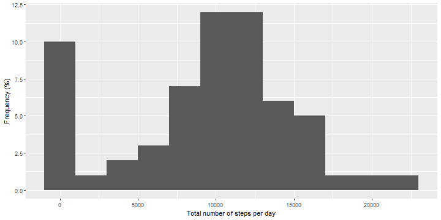
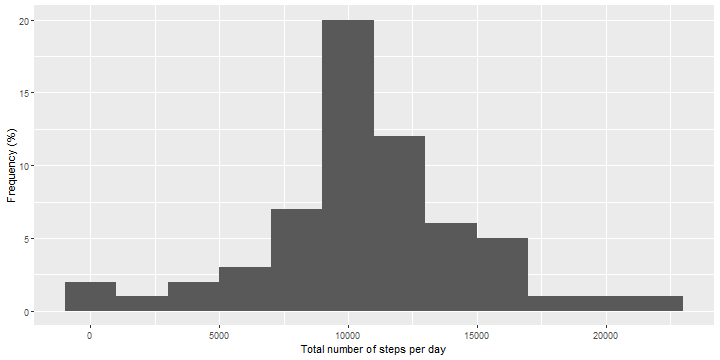

## Loading and preprocessing the data
This is the code needed to

1. Load the data

1. Process/transform the data into a format suitable for your analysis

### Load the data

Let start by configuring the code chunks.

```r
knitr::opts_chunk$set(echo = TRUE, warning = FALSE, fig.width = 10, fig.height = 5, fig.keep = 'all' ,fig.path = 'figures/ ', dev = 'png')
```
   
The data shall be first unzipped and later loaded by means of the `read.csv` function.

```r
unzip("activity.zip")
activity <- read.csv("activity.csv", colClasses=c("numeric", "Date", "numeric"))
```

### Process/transform the data

For this analysis we will use the `ggplot2` and `dplyr` libraries.

```r
library(ggplot2)
library(dplyr)  
library(lubridate)
```

Now let explore the data by defining the size, the variable names and a short preview of the dataset.

```r
dim(activity)
```

```
## [1] 17568     3
```

```r
names(activity)
```

```
## [1] "steps"    "date"     "interval"
```

```r
head(activity)
```

```
##   steps       date interval
## 1    NA 2012-10-01        0
## 2    NA 2012-10-01        5
## 3    NA 2012-10-01       10
## 4    NA 2012-10-01       15
## 5    NA 2012-10-01       20
## 6    NA 2012-10-01       25
```

In this dataset the overall number of days covered is:

```r
numOfDay<-length(unique(activity$date))
```

## What is mean total number of steps taken per day?

For this part of the assignment we ignore the missing values in the dataset.

1. Make a histogram of the total number of steps taken each day.

1. Calculate and report the **mean** and **median** total number of steps taken per day.

### Make a histogram of the total number of steps per day

The data needs to be grouped by date adding together all the steps taken each day.

```r
total_steps_per_day <- activity %>%
  group_by(date) %>%
  summarise(daily_steps = sum(steps, na.rm = TRUE))
```

Let's have a look to the new data structure.

```r
head(total_steps_per_day)
```

```
## # A tibble: 6 × 2
##   date       daily_steps
##   <date>           <dbl>
## 1 2012-10-01           0
## 2 2012-10-02         126
## 3 2012-10-03       11352
## 4 2012-10-04       12116
## 5 2012-10-05       13294
## 6 2012-10-06       15420
```

Finally we can plot the hisotgram of the steps per day.

```r
ggplot(total_steps_per_day, aes(daily_steps)) + geom_histogram(binwidth = 2000) +
  xlab("Total number of steps per day") + 
  ylab("Frequency (%)")
```



### Calculate the mean and median of the steps per day

The mean number of steps taker per day is:

```r
mean_raw<-mean(total_steps_per_day$daily_steps, na.rm=TRUE)
mean_raw
```

```
## [1] 9354.23
```

The median number of steps taker per day is:

```r
median_raw<-median(total_steps_per_day$daily_steps, na.rm=TRUE)
median_raw
```

```
## [1] 10395
```

## What is the average daily activity pattern?

1. Make a time series plot of the 5-minute interval and the average number of steps taken, averaged across all days

2. Which 5-minute interval, on average across all the days in the dataset, contains the maximum number of steps?

### Time series plot of the average number of steps per interval

The average number of steps taken per interval is:

```r
average_steps_per_interval <- activity %>% 
  group_by(interval) %>%
  summarise(steps = mean(steps, na.rm =TRUE))
```

Let's have a look to the new data structure.

```r
head(average_steps_per_interval)
```

```
## # A tibble: 6 × 2
##   interval  steps
##      <dbl>  <dbl>
## 1        0 1.72  
## 2        5 0.340 
## 3       10 0.132 
## 4       15 0.151 
## 5       20 0.0755
## 6       25 2.09
```

Finally we can plot the time series of the steps per daily intervals.

```r
ggplot(data=average_steps_per_interval, aes(x=interval, y=steps)) +
    geom_line() +
    xlab("5-minute intervals") +
    ylab("Average number of steps")
```


### Find the interval when the most steps are taken

The interval when, on average, the steps takes are max is:

```r
average_steps<-as.numeric(unlist(average_steps_per_interval[,2]))
average_steps_per_interval[which.max(average_steps),1]
```

```
## # A tibble: 1 × 1
##   interval
##      <dbl>
## 1      835
```

## Imputing missing values

Note that there are a number of days/intervals where there are missing
values (coded as `NA`). The presence of missing days may introduce
bias into some calculations or summaries of the data.

1. Calculate and report the total number of missing values in the dataset.

1. Devise a strategy for filling in all of the missing values in the dataset.

1. Create a new dataset that is equal to the original dataset but with the missing data filled in.

1. Make a histogram of the total number of steps taken each day and calculate and report the **mean** and **median** total number of steps taken per day.

### Calculate the total number of missing values

There are some `NA` in the dataset that should be managed carefully.

```r
missingIndex<-is.na(activity[,1])
sum(is.na(activity$steps))
```

```
## [1] 2304
```

### Strategy to fill in the NAs

The mean values is used for imputing the number of steps for missing values. 

### Creating a new dataset without the NAs filled

To impute the missing values in the data, firstly, I matched the averages by interval across dates with the intervals in the original data.

```r
# impute missing steps with interval averages across days
new_activity <- activity %>%
  mutate(steps = case_when(is.na(steps) ~ average_steps_per_interval$steps[match(activity$interval,  average_steps_per_interval$interval)], TRUE ~ as.numeric(steps)))
```

### Make a histogram anc calculate the mean and the median of the new dataset

x

```r
new_total_steps_per_day <- new_activity %>% 
  group_by(date) %>% 
  summarise(daily_steps = sum(steps))

ggplot(new_total_steps_per_day, aes(daily_steps)) + 
  geom_histogram(binwidth = 2000) + 
  xlab("Total number of steps per day") + 
  ylab("Frequency (%)")
```




```r
new_mean_raw = mean(new_total_steps_per_day$daily_steps)
new_mean_raw
```

```
## [1] 10766.19
```

```r
new_median_raw = median(new_total_steps_per_day$daily_steps)
new_median_raw
```

```
## [1] 10766.19
```

## Are there differences in activity patterns between weekdays and weekends?

Use the dataset with the filled-in missing values for this part.

1. Create a new factor variable in the dataset with two levels -- "weekday" and "weekend" indicating whether a given date is a weekday or weekend day.

1. Make a panel plot containing a time series plot of the 5-minute interval and the average number of steps taken, averaged across all weekday days or weekend days.

### Dataset partitioning in "weekday" and "weekend"

Let's build the new dataset.

```r
day_of_week <- new_activity %>%
  mutate(
    date = ymd(date),
    weekday_or_weekend = case_when(wday(date) %in% 2:6 ~ "Weekday",
                                   wday(date) %in% c(1,7) ~ "Weekend")) %>%
  select(-date) %>%
  group_by(interval, weekday_or_weekend) %>%
  summarise(steps = mean(steps))
```

```
## `summarise()` has grouped output by 'interval'. You can override using the
## `.groups` argument.
```

### Time series plot of the of steps taken across all weekday days or weekend days

Finally we can plot the two required time series of average steps taken, during the weekend or during the weekday.

```r
ggplot(day_of_week, aes(interval, steps)) + 
  geom_line() + 
  facet_wrap(~weekday_or_weekend, nrow = 2) +
  xlab("5-Minute intervals") + 
  ylab("Average number of steps")
```


